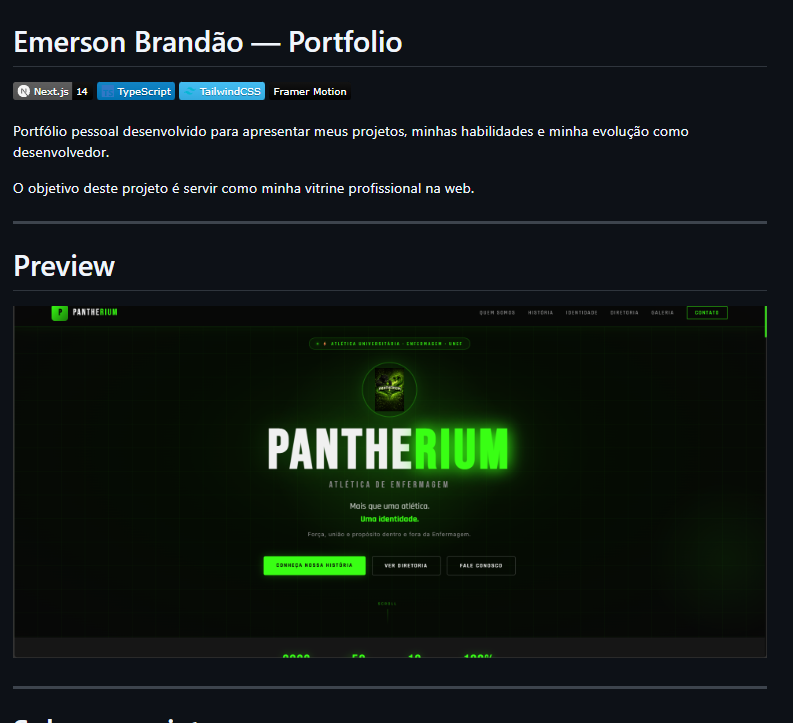

# Emerson Brandão — Portfolio

[]()
[]()
[]()
[]()

Portfólio pessoal desenvolvido para apresentar meus projetos, minhas habilidades e minha evolução como desenvolvedor.

O objetivo deste projeto é servir como minha vitrine profissional na web.

---

# Preview



---

# Sobre o projeto

Este portfólio foi desenvolvido com foco em:

- design moderno
- interface premium
- organização de código
- componentização
- experiência visual agradável
- responsividade

O layout utiliza uma estética **dark premium**, com animações suaves e profundidade visual para destacar conteúdo e projetos.

---

# Tecnologias utilizadas

- Next.js
- TypeScript
- Tailwind CSS
- Framer Motion
- Lucide React

---

# Estrutura do projeto

```bash
portfolio/
├── app/
│   ├── layout.tsx
│   ├── page.tsx
│   ├── globals.css
│   ├── sobre/
│   │   └── page.tsx
│   ├── projetos/
│   │   └── page.tsx
│   └── contato/
│       └── page.tsx
│
├── components/
│   ├── layout/
│   │   ├── Header.tsx
│   │   ├── Footer.tsx
│   │   └── Container.tsx
│   │
│   ├── sections/
│   │   ├── Hero.tsx
│   │   ├── About.tsx
│   │   ├── Skills.tsx
│   │   ├── Projects.tsx
│   │   └── Contact.tsx
│   │
│   └── ui/
│       ├── GlowBackground.tsx
│       ├── SectionTitle.tsx
│       ├── CTAButton.tsx
│       ├── SkillBadge.tsx
│       ├── ProjectCard.tsx
│       ├── SocialLinks.tsx
│       └── AnimatedGrid.tsx
│
├── lib/
│   ├── data.ts
│   └── utils.ts
│
├── public/
│   └── images/
│
├── package.json
├── tailwind.config.ts
├── tsconfig.json
└── next.config.js


Seções do portfólio
Hero

Apresentação inicial com introdução profissional e links principais.

Sobre

Resumo sobre mim e minha trajetória como desenvolvedor.

Habilidades

Lista das principais tecnologias que fazem parte da minha stack atual.

Projetos

Sessão com projetos desenvolvidos e links para repositórios.

Contato

Formas de contato e redes profissionais.

Projetos em destaque
Pantherium

Repositório:
https://github.com/emersonbrandao058-dot/pantherium

Demo:
https://pantherium.vercel.app/

META-10

Repositório:
https://github.com/emersonbrandao058-dot/META-10

Monitor Inteligente

Repositório:
https://github.com/emersonbrandao058-dot/MONITOR-INTELIGENTE

Contato

Email
emersonbrandao058@gmail.com

GitHub
https://github.com/emersonbrandao058-dot

LinkedIn
https://www.linkedin.com/in/emerson-brandao-b33839337

Instagram
https://www.instagram.com/brandao.emerson/

Licença

Projeto de portfólio pessoal.
